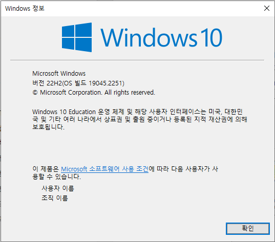
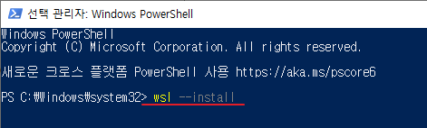
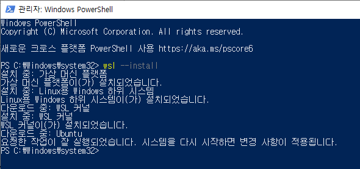
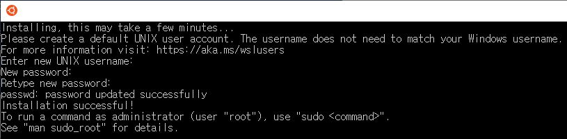
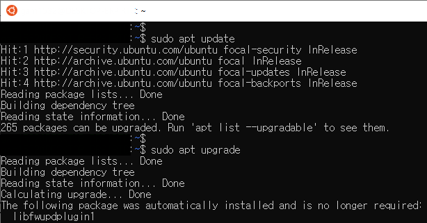

# <Day1 : WSL을 이용한 Linux 환경구성 방법에 대한 보고서>

## **1. WSL을 설치하기 위한 window 버전 확인**
최신 버전의 윈도우 10 버전 2004이상 혹은 윈도우 11 이상이라면 사용할 수 있습니다.
확인방법은 윈도우 10 시작 버튼 옆 검색 버튼을 누르고 'winver' 을 입력한 후 버전을 확인하시면 됩니다.



--- 

## **2. WSL 및 리눅스 배포판 설치**
윈도우 10 시작 버튼 옆 검색 버튼을 누르고 'powershell' 을 입력한 다음 관리자 권한으로 실행합니다.
쉘이 뜨면 아래 코드를 입력하여 WSL의 기본 리눅스 환경인 Ubuntu 환경을 설치해 줍니다.

```
wsl --install 
```



Ubuntu가 아닌 다른 종류를 설치하고 싶으면 powershell 에서 아래 코드를 을 입력하여 제공하는 배포판의 
목록을 확인 후 설치합니다.

```
wsl --list --online                  -> 배포판의 목록 확인
wsl --install -d <DistroName>        -> <DistroName> 버전 설치
```

실행을 하면 기본적인 환경 세팅과 구동할 수 있는 환경을 준비해 줍니다. 끝나면 아래와 같이 준비되었다고 뜹니다.



컴퓨터를 재부팅을 하면 아래 그림처럼 창이 떠서 Ubuntu 환경 준비가 시작됩니다. 
마지막으로 리눅스 시스템에서 사용할 사용자 이름과 암호를 입력하면 끝나게 됩니다.



--- 

## **3. 테스트 패키지 업데이트를 진행**
패키지 저장소 업데이트를 위해 sudo apt update를 입력하고, 끝나면 sudo apt upgrade를 입력하면 됩니다.

```
sudo apt update
sudo apt upgrade
```

