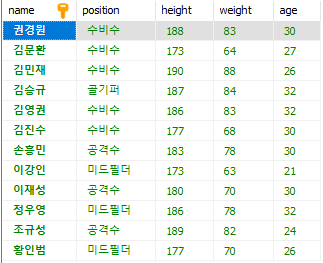
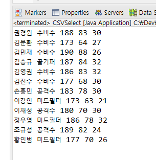
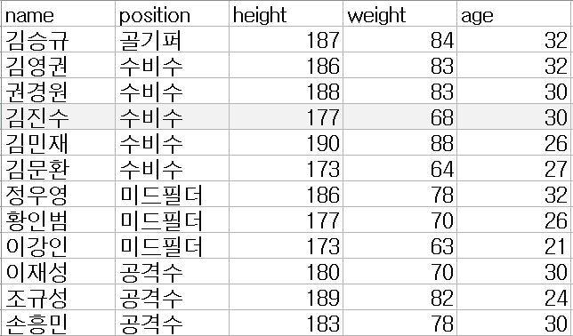

# Day5. csv파일을 JDBC를 사용하여 DB와 연결 및 코드 수행

## 01. 수행 결과

> ### `CSVRead.java` 파일 실행

- 비어 있던 `WORLDCUP_MEMBER` 테이블에 데이터 `INSERT` 수행.

 

> ### `CSVSelect.java` 파일 실행

- `WORLDCUP_MEMBER` 테이블에 있는 데이터 `SELECT` 수행.

---

 

## 02. 프로젝트 구성

사용한 코드의 간략한 설명은 각 파일에 주석으로 입력했음.

> `월드컵 명단.csv`

: 데이터가 담겨있는 `.csv` 형식의 파일

 

> `CSVRead.java`

: `월드컵 명단.csv` 파일의 데이터를 읽어온 후에 JDBC(MySql-Connector 8.0.30)를 사용하여 DB와 연결
및 `INSERT`문을 실행하여 데이터 입력하는 파일.

 

> `UserBean.java`

: 데이터의 내용을 가져오는 반복 작업을 줄이기 위해 사용.

## 03. 사용 Lib 설명

- `java.io.*`
	- `FileReader`, `BufferedReader` 클래스 등 사용

- `java.sql.*`
	- `Connection`, `PreparedStatement` 클래스 등 사용

- `java.util.*`
	- `List`, `ArrayList` 클래스 등 사용
